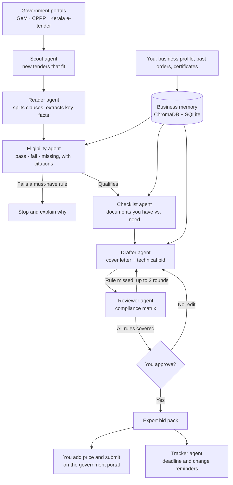

# TenderSathi

**Helping small businesses win government contracts, without the paperwork headache.**

TenderSathi is a team of AI agents that works for small businesses: local shops, workshops, and
women-led and taluk/district firms.
It finds government tenders that suit the business, reads the long tender documents, checks every
rule, and prepares a complete bid.
The business owner reviews it, adds their price, and submits it themselves on the government portal.

▶️ **Try it:** TenderSathi runs on your own computer. See [Run it yourself](#run-it-yourself).

---

## What it does

TenderSathi has three views of one platform: the **business owner**, the **government buyer**, and the
**platform team**. Switch between them with the toggle in the header.

### For small businesses

- **Finds tenders on its own.** The Scout agent sweeps the tender portals (GeM, CPPP, Kerala e-tender),
  brings every new tender into the inbox, and starts the other agents on the ones that fit your business.
- **Bid or no-bid, in one number.** Every tender gets a score out of 100 with the reasons: rules you
  meet, documents you still need, days left, and concessions you can claim.
- **Marks the right tenders.** Marks which tenders in your inbox fit what your business makes or does
  (and whether they mention your area), and lets you hide the rest.
- **Reads the tender for you.** Turns a long tender document into a short summary: deadline,
  deposit, turnover rule, experience rule and required documents.
- **Tells you if you qualify.** Checks every rule against your business profile and says
  *pass*, *fail* or *missing*, with the exact clause and page it came from.
- **Builds your checklist.** Lists every document the tender needs, marks what you already have,
  and flags what is missing. It also lists the small-business concessions the tender gives you
  (for example, no EMD for Udyam-registered firms).
- **Drafts your bid.** Writes the cover letter and technical sections using your own past work
  and certificates.
- **Double-checks everything.** A reviewer agent confirms every mandatory rule is answered before
  anything leaves your hands.
- **Keeps you on time.** Shows how many days are left on every tender, puts the nearest deadline
  first, and when a tender is changed (corrigendum) lists exactly what changed.
- **Remembers your business.** Your profile, past orders and documents are stored once, so every
  new bid is faster than the last.
- **Plans how to close the gaps.** For every missing document or unproven rule, it says where to get it,
  how long it takes, and whether that fits before the deadline.
- **Keeps you in control.** TenderSathi never contacts the government and never submits for you.
  You approve, you price, you submit.

### For government buyers

- **Fairness check before publishing.** Upload a draft tender. The Fairness agent pulls the clauses
  related to each small-business policy check from the vector memory (RAG) and flags what works against
  micro and small enterprises: no EMD exemption, tender fees, turnover out of proportion to the order,
  experience limited to one kind of buyer, brand-locked specifications, slow payment. Each flag cites the
  clause, the policy behind it, and a fix the officer can paste in.
- **Who can bid?** Screens every business registered on TenderSathi against a tender's rules and shows
  which rule shuts out how many (for example, "0 of 5 MSEs qualify; clause 4.1 excludes 5"). Only totals
  and anonymous labels are shown, never a business's name or profile.

### For the platform team

- **Agent health.** Runs, average time, retries and failures for every agent, the model each one uses,
  and the latest runs.
- **Scout activity.** Every portal sweep and what it found.
- **Measured accuracy.** Owners mark eligibility verdicts right or wrong; the dashboard shows how often
  the agent agrees with them.

---

## Screenshots

All screenshots are from the running app (see the [`screenshots/`](screenshots) folder).

<table>
  <tr>
    <td colspan="3" align="center">
      <br>
      <b>Eligibility report</b>: every rule marked pass, fail or missing, with the page it came from
    </td>
  </tr>
  <tr>
    <td width="33%" align="center" valign="top">
      <br>
      <b>Tender inbox</b>: only the tenders that fit your business
    </td>
    <td width="33%" align="center" valign="top">
      <br>
      <b>Watch the agents work</b>: each step shown live
    </td>
    <td width="33%" align="center" valign="top">
      <br>
      <b>Document checklist</b>: what you have and what is missing
    </td>
  </tr>
  <tr>
    <td colspan="2" width="50%" align="center" valign="top">
      <br>
      <b>Drafted bid</b>: cover letter and technical sections, ready to review
    </td>
    <td width="50%" align="center" valign="top">
      <br>
      <b>Compliance matrix</b>: proof that every rule is covered
    </td>
  </tr>
</table>

---

## How it works

1. **You set up your business once**: what you make, past orders, certificates and turnover.
2. **The Scout agent finds tenders** on the government portals (GeM, CPPP, Kerala e-tender) and adds the
   ones that fit your business. You can also upload a tender PDF yourself.
3. **The Reader agent** opens the document, splits it into clauses, and pulls out the key facts:
   deadline, deposit, eligibility rules and required documents.
4. **The Eligibility agent** compares each rule with your business memory and gives a verdict,
   citing the clause behind every answer.
5. **The Checklist agent** matches each required document to your stored files and flags the gaps.
6. **The Drafter agent** writes your bid from your own business details.
7. **The Reviewer agent** checks the draft against every mandatory rule and builds a compliance matrix.
8. **You review and approve.** The pipeline pauses here and nothing is final until you say yes.
9. **You add your price and submit** on the government portal. TenderSathi then reminds you of
   deadlines and any changes to the tender.

### Flowchart



---

## Tech stack

| Part | What we used |
|---|---|
| **Website (frontend)** | React (JavaScript), Vite, Tailwind CSS |
| **Pages and data loading** | React Router, TanStack Query |
| **Server (backend)** | Python, FastAPI |
| **Agent orchestration** | LangGraph (a graph with a stop branch and a review loop) |
| **Agents and AI calls** | LangChain chat models: Scout, Reader, Tracker, Eligibility, Checklist, Drafter, Reviewer, plus Fairness and Gap planner |
| **Checked agent outputs** | Pydantic, via LangChain structured output |
| **AI model** | Groq: `openai/gpt-oss-120b` for most agents, `qwen/qwen3.8-27b` for eligibility (set per agent in `config.py`) |
| **Reading PDFs** | PyMuPDF |
| **Vector memory** | ChromaDB (runs inside the app, no server needed) |
| **App data and agent log** | SQLite |
| **Live progress** | The website checks the agent log every 2 seconds |
| **Testing** | pytest |

---

## Run it yourself

You need **Python 3.11** and **Node.js 18+**. Run these from the project folder.

**1. Add your settings**

```bash
cp .env.example .env
```

Open `.env` and add your Groq API key (`GROQ_API_KEY`, from console.groq.com).

**2. Start the server**

```bash
cd backend
python -m venv .venv
source .venv/bin/activate        # Windows: .venv\Scripts\activate
pip install -r requirements.txt
uvicorn app.main:app --port 8000
```

**3. Start the website** (in a second terminal)

```bash
cd frontend
npm install
npm run dev
```

**4. Open** http://localhost:5173

Optional extras:

- **Sample data:** from the project folder, run `backend/.venv/bin/python scripts/load_demo_data.py`.
  It loads the sample business profile and six other sample businesses, then prints a link
  (`http://localhost:5173/?company=1`). Open that link once so the website uses the sample profile,
  then press **Find new tenders**: the Scout brings in the five sample tenders from the portal feed
  (`data/feed/portal_feed.json`) and starts the agents on the three that fit.
- **Demo logins:** the loader also creates one account per view (business owner, government buyer,
  platform admin), listed in [`data/demo_accounts.json`](data/demo_accounts.json). The login page has
  one-click buttons that fill them in. Anyone can sign up as a business owner or a government buyer;
  platform accounts come only from that file.
- **Autonomous mode:** set `SCOUT_INTERVAL_SECONDS=300` in `.env` and the Scout sweeps the portals by itself
  every five minutes.
- **Run the tests:** `cd backend && pytest`

---

## What we fixed

Today, small businesses face these problems when bidding for government work. TenderSathi fixes them:

- **Good tenders were missed.** Owners checked several government websites by hand. Now the
  matching tenders come to them.
- **Rules were buried in long documents.** One missed clause meant rejection. Now every rule is
  checked and linked to its page.
- **Paperwork was rebuilt for every bid.** The same profile and certificates were typed again each
  time. Now the business memory fills them in.
- **Help was too expensive.** Consultants charge per bid, so small firms bid rarely. Now the first
  draft is done for them.
- **Tender changes went unnoticed.** Updates to dates and terms were easy to miss. Now the tracker
  compares the changed tender with the old one and shows each change.
- **AI answers could not be trusted.** A plain chatbot can make things up. Here every verdict cites
  the clause it came from, and a human approves before anything is final.

---

## Good to know

- TenderSathi is **a tool, not a middleman**. It never contacts the government, never submits bids
  and never takes a share of any contract.
- The repo ships **five sample tenders** (fictional buyers, marked "SAMPLE TENDER" on every page),
  listed in a sample portal feed that stands in for the GeM, CPPP and Kerala e-tender listings. One is
  written to be unfair to small firms, for the government demo. Reading the live portals is the next step:
  the Scout only needs a connector that turns a portal's listing into the same feed format.
- The **final price is always set by the business owner**. TenderSathi does not suggest bid prices yet.
- Eligibility checks help the owner decide, but **the tender document is always the final word**.
  Always read the flagged clauses before submitting.
- Demo business profiles use **sample data only**.

---

*Built solo for a 24-hour hackathon, Track 1: Autonomous AI Agents.*
