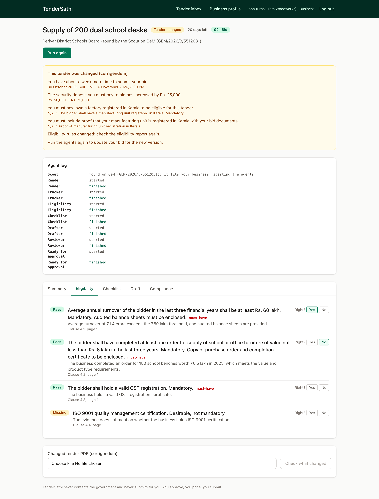
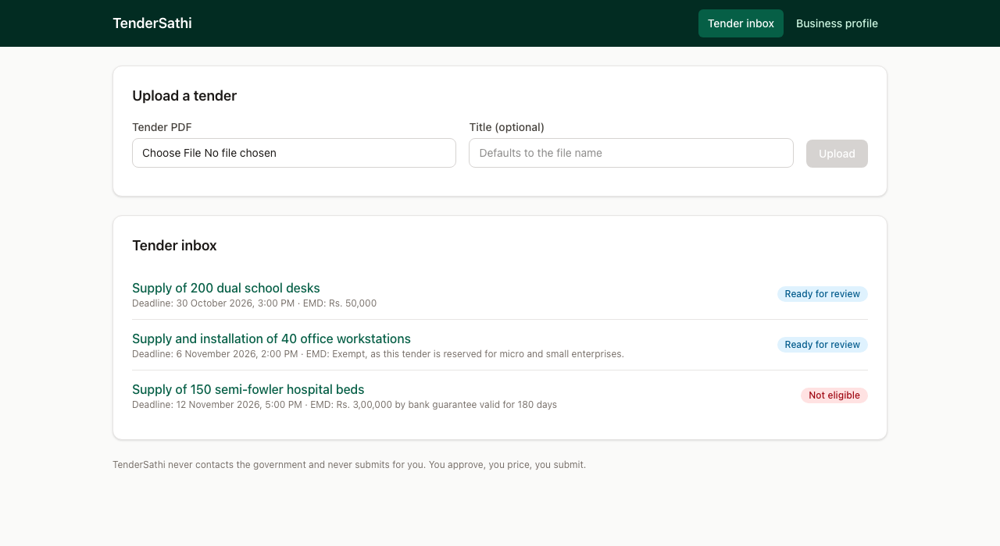
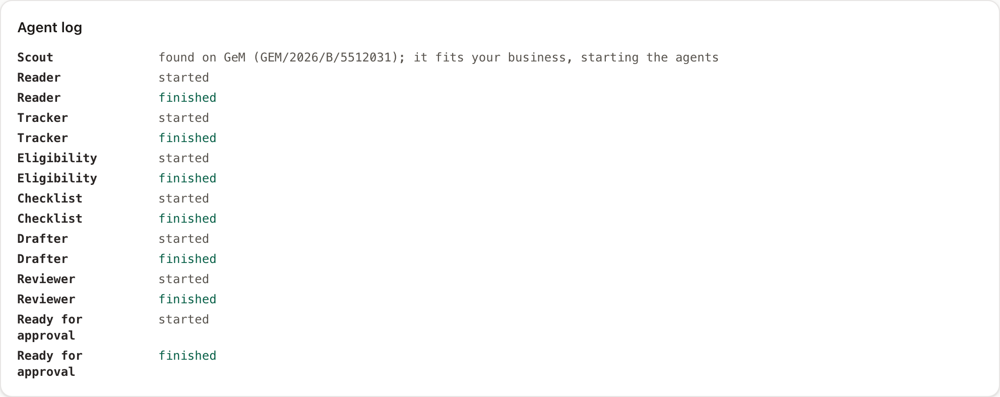
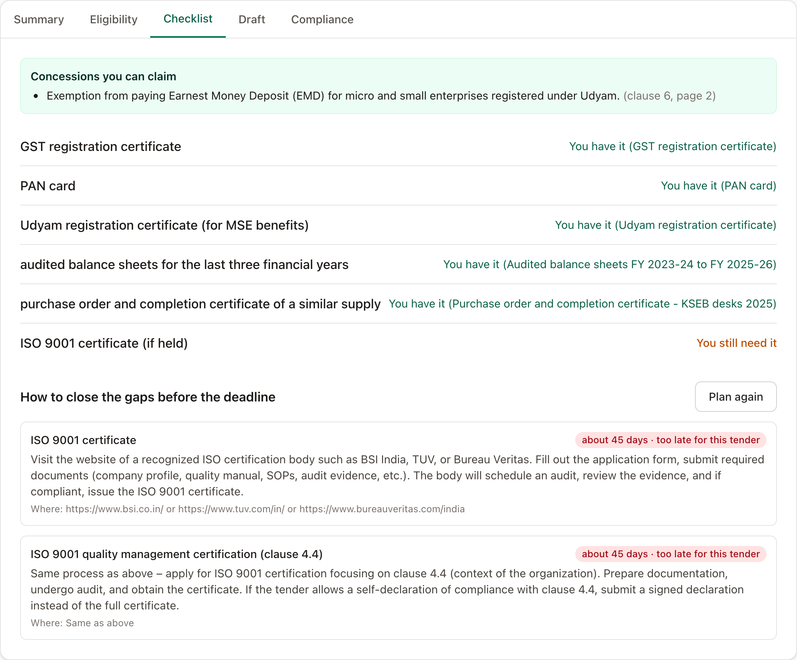
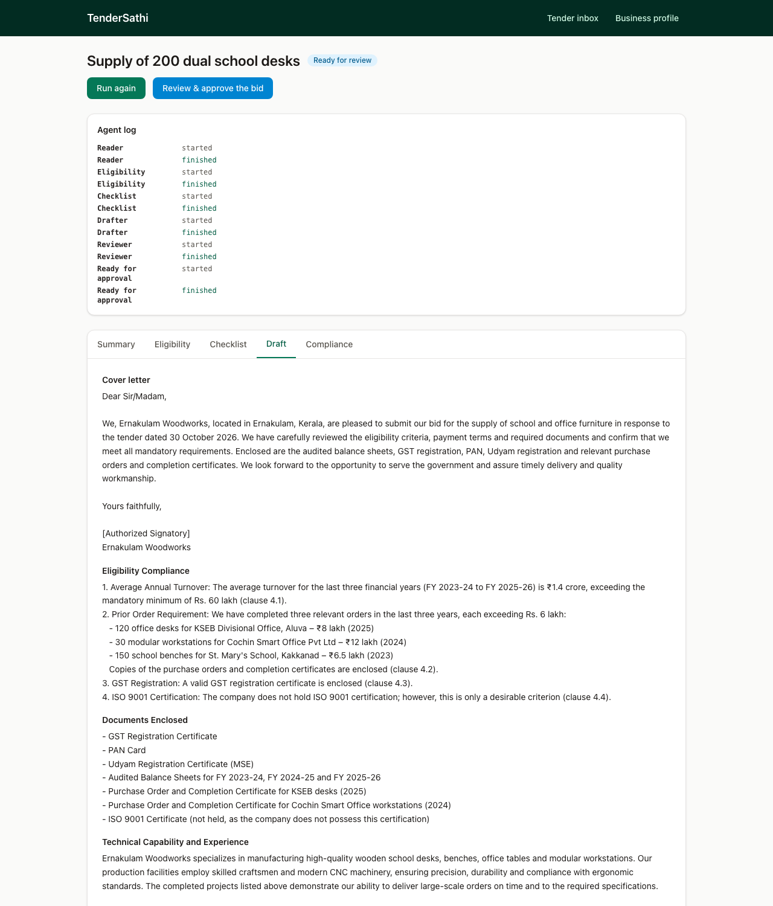
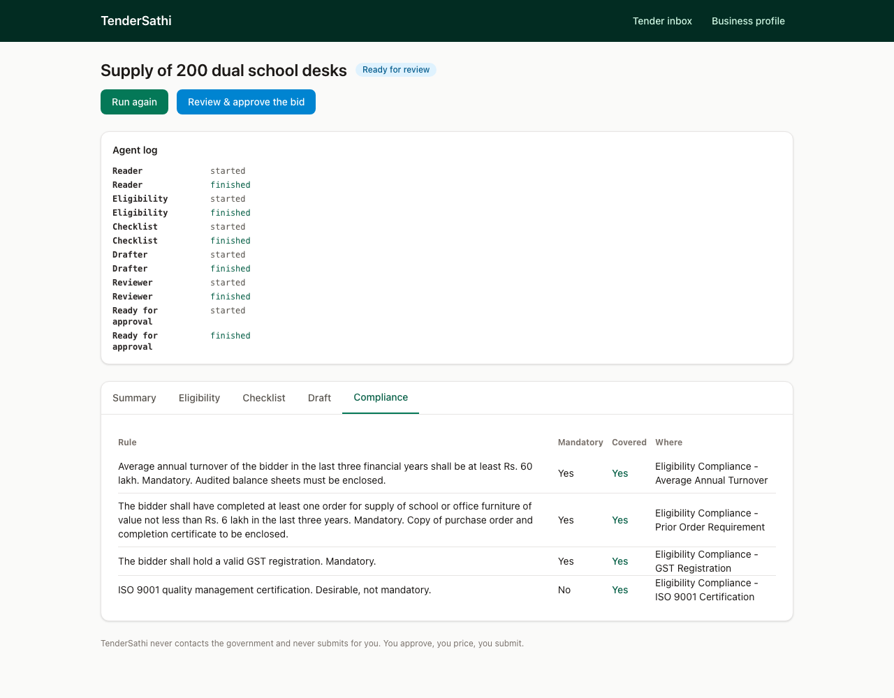
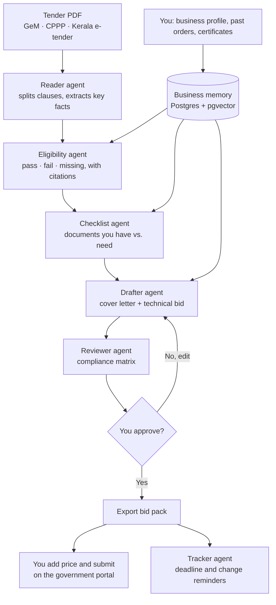

# TenderSathi

**Helping small businesses win government contracts, without the paperwork headache.**

TenderSathi is a team of AI agents that works for small businesses: local shops, workshops, and
women-led and taluk/district firms.
It finds government tenders that suit the business, reads the long tender documents, checks every
rule, and prepares a complete bid.
The business owner reviews it, adds their price, and submits it themselves on the government portal.

🌐 **Live demo:** *Coming soon*
*(The demo runs locally first. A public link will be added here if it is deployed.)*

---

## What it does

- **Finds the right tenders.** Shows only the tenders that match what your business makes or does,
  where you work, and the order size you can handle.
- **Reads the tender for you.** Turns a long tender document into a short summary: deadline,
  deposit, turnover rule, experience rule and required documents.
- **Tells you if you qualify.** Checks every rule against your business profile and says
  *pass*, *fail* or *missing*, with the exact clause and page it came from.
- **Builds your checklist.** Lists every document the tender needs, marks what you already have,
  and flags what is missing. It also points out small-business concessions where the tender allows them.
- **Drafts your bid.** Writes the cover letter and technical sections using your own past work
  and certificates.
- **Double-checks everything.** A reviewer agent confirms every mandatory rule is answered before
  anything leaves your hands.
- **Keeps you on time.** Reminds you about deadlines and warns you if the tender is changed later.
- **Remembers your business.** Your profile, past orders and documents are stored once, so every
  new bid is faster than the last.
- **Keeps you in control.** TenderSathi never contacts the government and never submits for you.
  You approve, you price, you submit.

---

## Screenshots

All screenshots will be taken from the running app (see the [`screenshots/`](screenshots) folder).

<table>
  <tr>
    <td colspan="3" align="center">
      <br>
      <b>Eligibility report</b>: every rule marked pass, fail or missing, with the page it came from
    </td>
  </tr>
  <tr>
    <td width="33%" align="center" valign="top">
      <br>
      <b>Tender inbox</b>: only the tenders that fit your business
    </td>
    <td width="33%" align="center" valign="top">
      <br>
      <b>Watch the agents work</b>: each step shown live
    </td>
    <td width="33%" align="center" valign="top">
      <br>
      <b>Document checklist</b>: what you have and what is missing
    </td>
  </tr>
  <tr>
    <td colspan="2" width="50%" align="center" valign="top">
      <br>
      <b>Drafted bid</b>: cover letter and technical sections, ready to review
    </td>
    <td width="50%" align="center" valign="top">
      <br>
      <b>Compliance matrix</b>: proof that every rule is covered
    </td>
  </tr>
</table>

---

## How it works

1. **You set up your business once**: what you make, past orders, certificates and turnover.
2. **You add a tender**, either by uploading the tender PDF from a government portal (GeM, CPPP or
   the Kerala e-tender site) or from the tender inbox.
3. **The Reader agent** opens the document, splits it into clauses, and pulls out the key facts:
   deadline, deposit, eligibility rules and required documents.
4. **The Eligibility agent** compares each rule with your business memory and gives a verdict,
   citing the clause behind every answer.
5. **The Checklist agent** matches each required document to your stored files and flags the gaps.
6. **The Drafter agent** writes your bid from your own business details.
7. **The Reviewer agent** checks the draft against every mandatory rule and builds a compliance matrix.
8. **You review and approve.** The pipeline pauses here and nothing is final until you say yes.
9. **You add your price and submit** on the government portal. TenderSathi then reminds you of
   deadlines and any changes to the tender.

### Flowchart



---

## Tech stack

| Part | What we used |
|---|---|
| **Website (frontend)** | React, Vite, TypeScript, Tailwind CSS, shadcn/ui |
| **Pages and data loading** | React Router, TanStack Query |
| **Server (backend)** | Python, FastAPI |
| **Agent pipeline** | LangGraph (fixed steps, shared state, approval pause) |
| **AI model** | Paid LLM API, behind one small wrapper so the provider can be swapped |
| **Reading PDFs** | Docling, with Tesseract OCR for scanned pages |
| **Database and vector memory** | PostgreSQL with pgvector |
| **Live progress** | Server-sent events from FastAPI to the website |
| **Tracing** | Langfuse (shows every agent step) |
| **Running it** | Docker Compose |

---

## Run it yourself

You need **Docker**, **Python 3.11** and **Node.js 18+**. Run these from the project folder.

**1. Add your settings**

```bash
cp .env.example .env
```

Open `.env` and add your LLM API key.

**2. Start the database**

```bash
docker compose up -d db
```

**3. Start the server**

```bash
python -m venv .venv
source .venv/bin/activate
pip install -r backend/requirements.txt
uvicorn backend.main:app --port 8000
```

**4. Start the website** (in a second terminal)

```bash
cd frontend
npm install
npm run dev
```

**5. Open** http://localhost:5173

Or start everything at once with `docker compose up`.

Optional extras:

- **Sample data:** `python scripts/load_demo_data.py` loads a sample business profile and demo tenders.
- **Agent tracing:** add your Langfuse keys to `.env` to see every agent step.
- **Run the tests:** `pytest`

---

## What we fixed

Today, small businesses face these problems when bidding for government work. TenderSathi fixes them:

- **Good tenders were missed.** Owners checked several government websites by hand. Now the
  matching tenders come to them.
- **Rules were buried in long documents.** One missed clause meant rejection. Now every rule is
  checked and linked to its page.
- **Paperwork was rebuilt for every bid.** The same profile and certificates were typed again each
  time. Now the business memory fills them in.
- **Help was too expensive.** Consultants charge per bid, so small firms bid rarely. Now the first
  draft is done for them.
- **Tender changes went unnoticed.** Updates to dates and terms were easy to miss. Now the tracker
  sends reminders.
- **AI answers could not be trusted.** A plain chatbot can make things up. Here every verdict cites
  the clause it came from, and a human approves before anything is final.

---

## Good to know

- TenderSathi is **a tool, not a middleman**. It never contacts the government, never submits bids
  and never takes a share of any contract.
- The demo uses **real tender PDFs downloaded by hand** from public portals. Live ingestion from
  official tender feeds is planned.
- The **final price is always set by the business owner**. TenderSathi does not suggest bid prices yet.
- Eligibility checks help the owner decide, but **the tender document is always the final word**.
  Always read the flagged clauses before submitting.
- Demo business profiles use **sample data only**.

---

## Demo video

▶️ **Watch the demo:** [VIDEO LINK HERE](#)

---

*Built solo for a 24-hour hackathon, Track 1: Autonomous AI Agents.*
