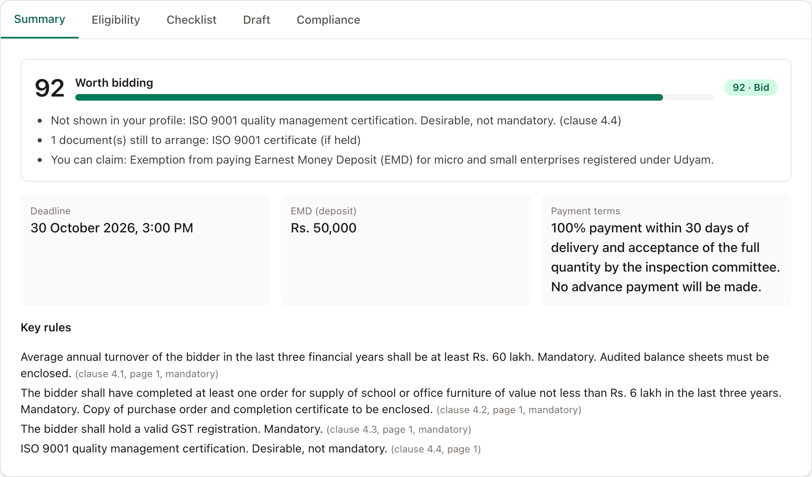
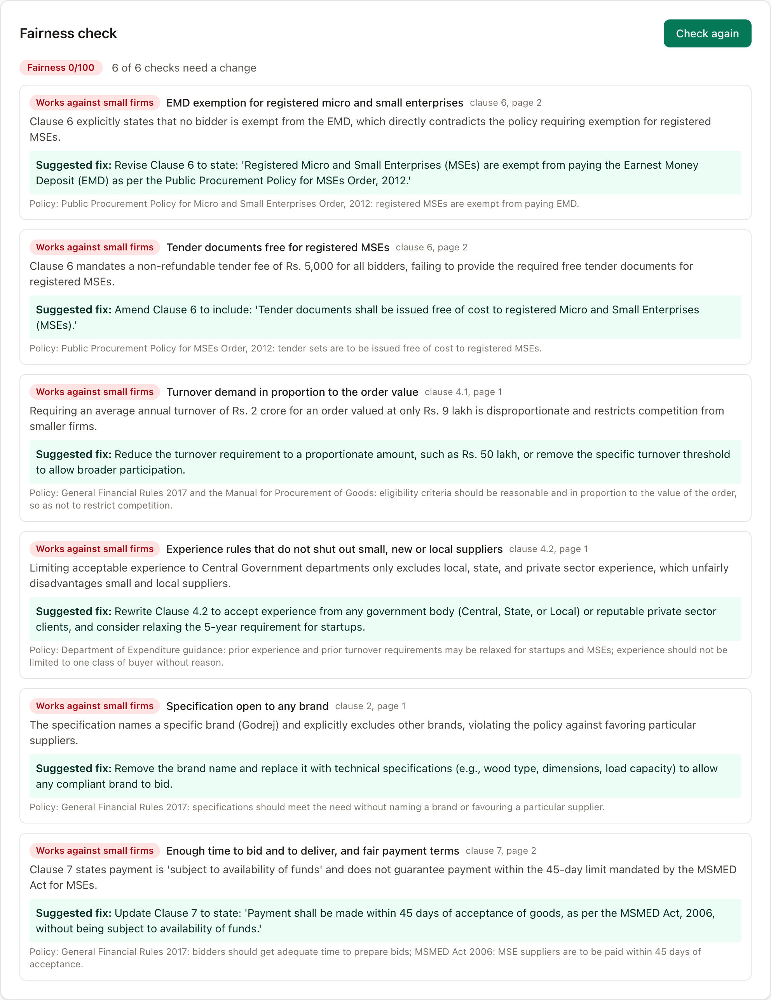
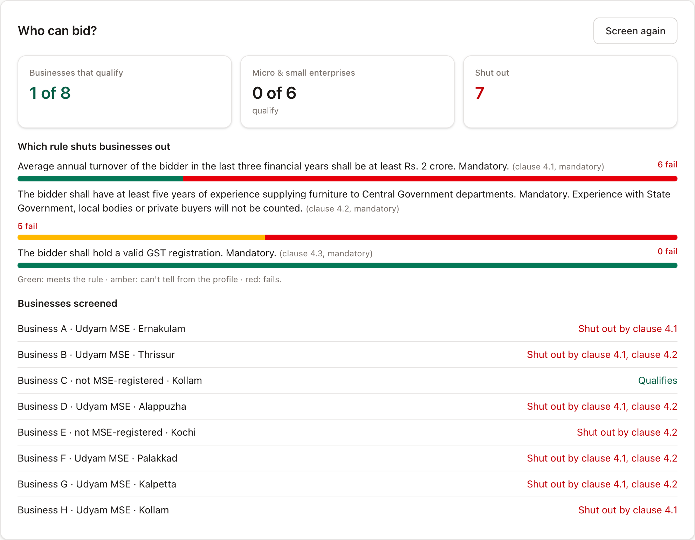
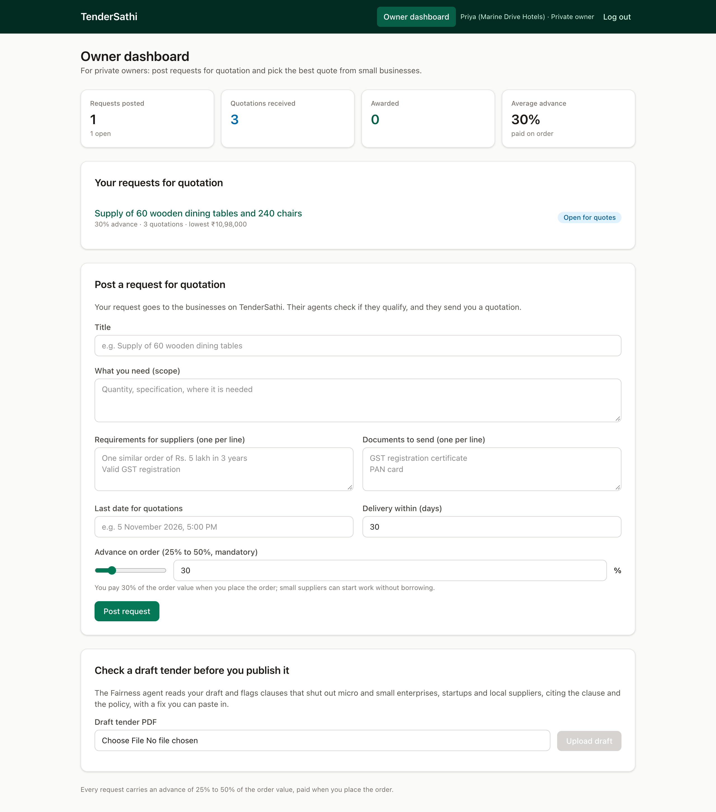
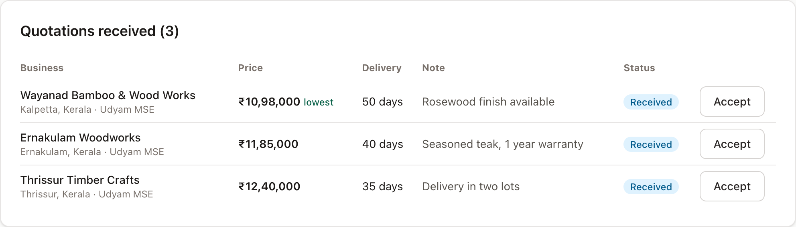
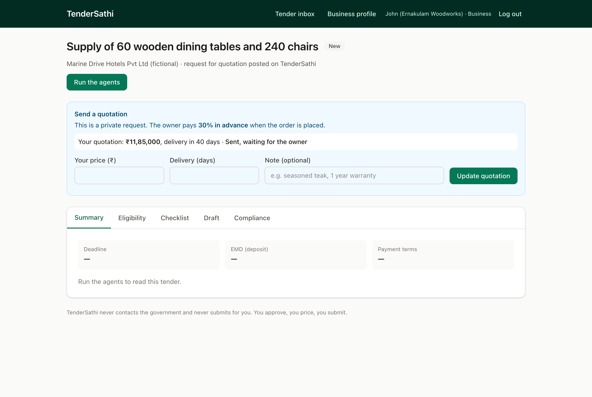
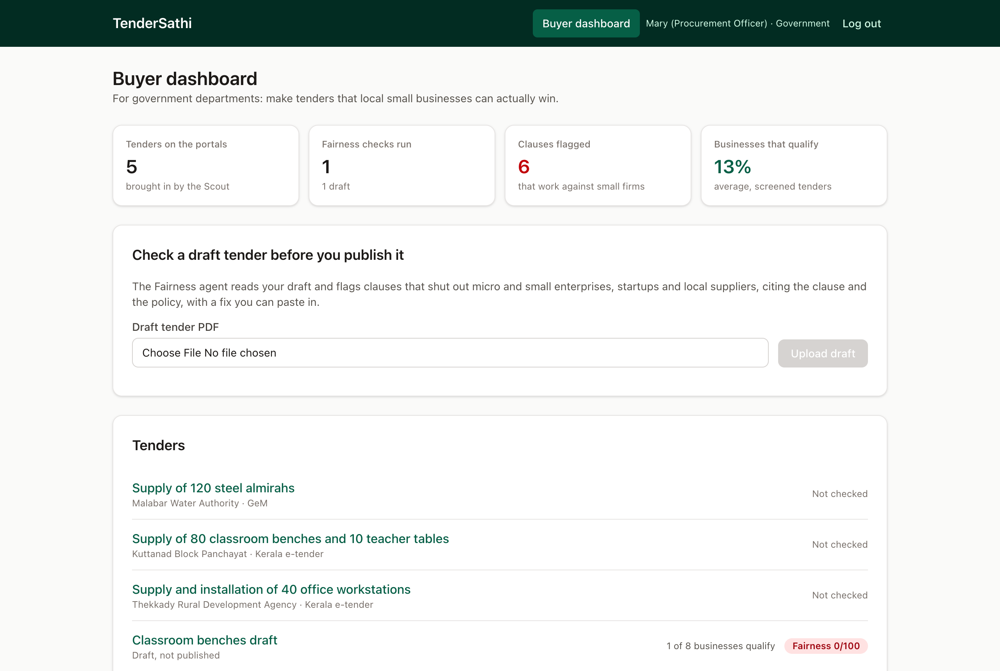
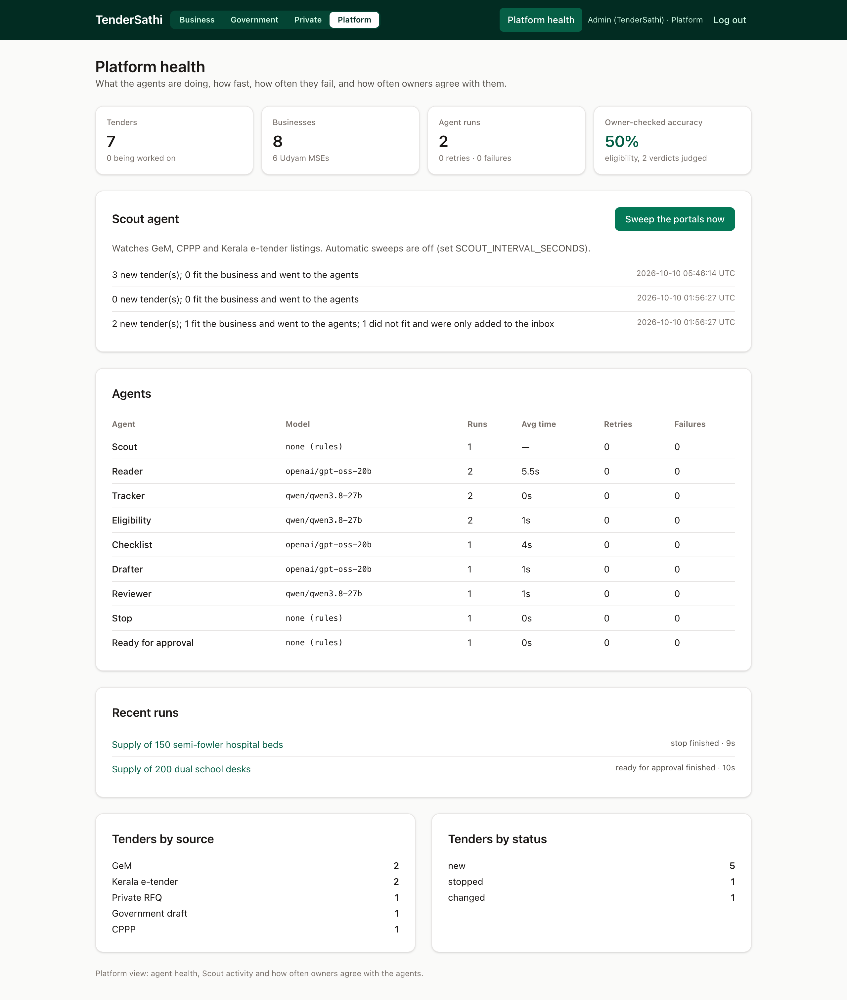
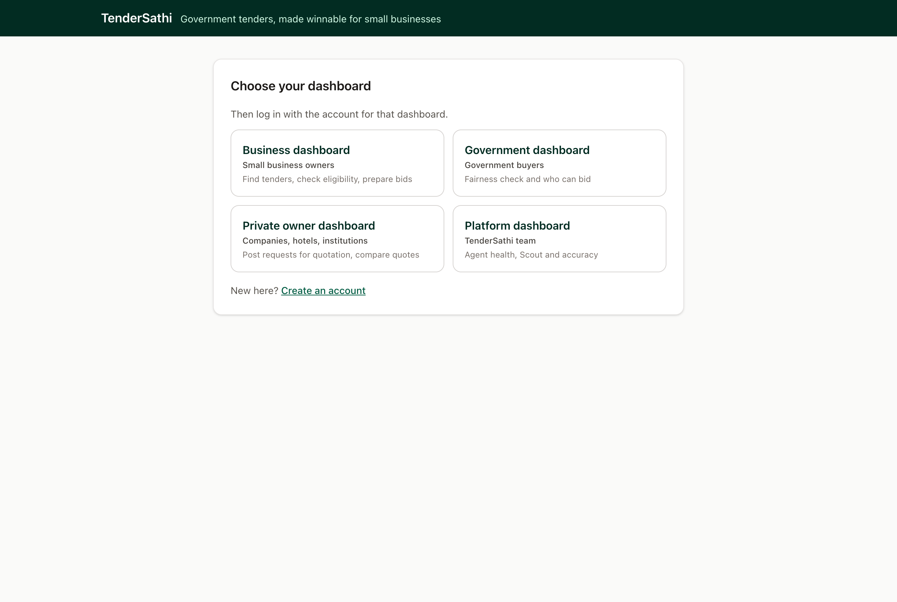
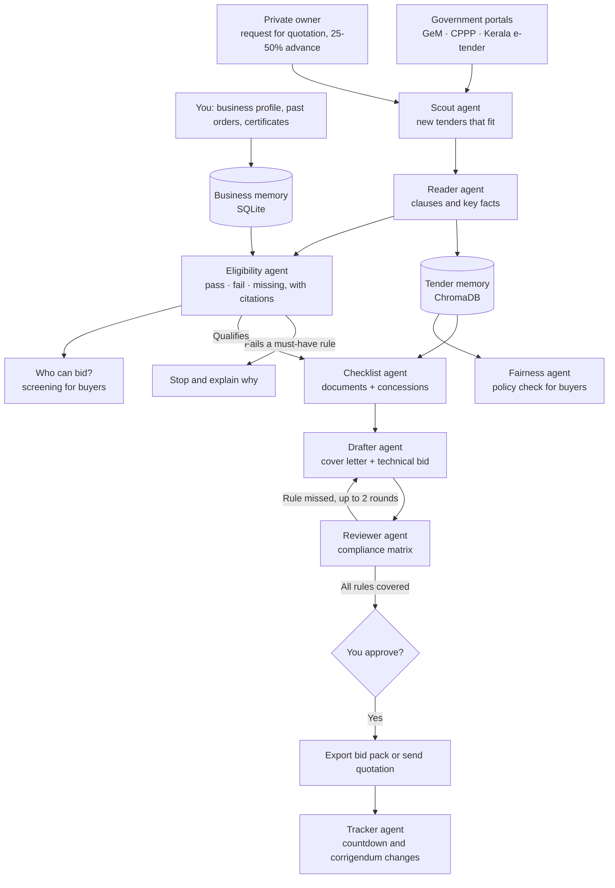

# TenderSathi

**Helping small businesses win government and private contracts, without the paperwork headache.**

TenderSathi is a team of AI agents that works for small businesses: local shops, workshops, and
women-led and taluk/district firms.
It finds tenders that suit the business, reads the long tender documents, checks every rule, and
prepares a complete bid. The owner reviews it, adds their price, and submits it themselves.
Government buyers and private owners use the same platform to write fairer tenders and to see who can bid.

🌐 **Live demo:** https://tendersathi-eight.vercel.app
*(Choose a dashboard; the demo login is filled in, so just press **Log in**. The website runs on Vercel and
the agents run on the team's machine, which is online during judging. To run everything yourself, see
[Run it yourself](#run-it-yourself).)*

---

## What it does

One platform, four dashboards: **business owner**, **government buyer**, **private owner** and
**platform team**.

**For small businesses**

- **Finds tenders on its own.** The Scout agent sweeps the tender portals (GeM, CPPP, Kerala e-tender)
  and starts the other agents on every tender that fits the business.
- **Bid or no-bid, in one number.** A score out of 100 with the reasons: rules met, documents
  missing, days left, and concessions you can claim.
- **Tells you if you qualify.** Every rule is marked *pass*, *fail* or *missing*, with the clause and
  page it came from. A clear fail on a must-have rule stops the run and says why.
- **Builds your checklist and a plan.** Shows the documents you have and the ones you need, how to get
  each missing one, and whether that fits before the deadline. Also lists the small-business
  concessions you can claim, such as no EMD for Udyam-registered firms.
- **Drafts and double-checks your bid.** Writes the cover letter and technical sections from your own
  past work; a reviewer agent confirms every mandatory rule is answered.
- **Keeps you on time.** Countdowns on every tender, and when a tender changes (corrigendum), a
  list of exactly what changed.
- **Quotes on private requests.** Sends your own price and delivery time to private owners who pay
  an advance.
- **Keeps you in control.** TenderSathi never submits for you. You approve, you price, you submit.

**For government buyers**

- **Fairness check before publishing.** The Fairness agent finds the clauses that work against micro
  and small enterprises: no EMD exemption, tender fees, turnover out of proportion to the order,
  experience limited to one kind of buyer, a named brand, and slow payment. It cites the clause and
  the policy, and gives a fix the officer can paste in.
- **Who can bid?** Screens every registered business against the rules and shows which rule shuts out
  how many, e.g. *"1 of 8 businesses qualify, 0 of 6 MSEs; clause 4.1 excludes 6"*. Only totals and
  anonymous labels are shown.

**For private owners**

- **Requests for quotation.** Companies, hotels and institutions post what they need with a short
  form; TenderSathi turns it into a tender the businesses' agents can read.
- **25% to 50% advance is mandatory.** Every request states the advance paid when the order is
  placed, so small suppliers can start work without borrowing.
- **Compare and accept quotations,** lowest first, plus the same fairness and "who can bid?" checks
  as government buyers.

**For the platform team**

- **Agent health:** runs, time, retries and failures for every agent, and the model each one uses.
- **Scout activity:** every portal sweep and what it found.
- **Measured accuracy:** owners mark verdicts right or wrong, and the dashboard shows how often the
  agent agrees.

---

## Screenshots

All screenshots are from the running app (see the [`screenshots/`](screenshots) folder).

<table>
  <tr>
    <td colspan="3" align="center">
      <br>
      <b>Eligibility report</b>: every rule marked pass, fail or missing with its clause and page, the bid score, the agent log, and what a corrigendum changed
    </td>
  </tr>
  <tr>
    <td width="33%" align="center" valign="top">
      <br>
      <b>Tender inbox</b>: found by the Scout, marked by fit, scored bid or no-bid
    </td>
    <td width="33%" align="center" valign="top">
      <br>
      <b>Bid or no-bid</b>: one score with the reasons
    </td>
    <td width="33%" align="center" valign="top">
      <br>
      <b>Checklist</b>: documents you have and need, plus concessions you can claim
    </td>
  </tr>
  <tr>
    <td width="33%" align="center" valign="top">
      <br>
      <b>Watch the agents work</b>: from the Scout to the Reviewer
    </td>
    <td width="33%" align="center" valign="top">
      <br>
      <b>Drafted bid</b>: cover letter and technical sections, price left to the owner
    </td>
    <td width="33%" align="center" valign="top">
      <br>
      <b>Compliance matrix</b>: proof that every rule is answered
    </td>
  </tr>
  <tr>
    <td colspan="2" width="66%" align="center" valign="top">
      <br>
      <b>Fairness check (government)</b>: six clauses that shut out small firms, each with the policy and a fix
    </td>
    <td width="33%" align="center" valign="top">
      <br>
      <b>Who can bid?</b>: which rule excludes how many businesses
    </td>
  </tr>
  <tr>
    <td width="33%" align="center" valign="top">
      <br>
      <b>Private owner dashboard</b>: post a request with a 25 to 50% advance
    </td>
    <td width="33%" align="center" valign="top">
      <br>
      <b>Quotations</b>: compare, lowest first, and accept one
    </td>
    <td width="33%" align="center" valign="top">
      <br>
      <b>Send a quotation</b>: the business sets its own price
    </td>
  </tr>
  <tr>
    <td width="33%" align="center" valign="top">
      <br>
      <b>Buyer dashboard</b>: fairness scores and screening totals
    </td>
    <td width="33%" align="center" valign="top">
      <br>
      <b>Platform health</b>: agent timings, retries, Scout sweeps and accuracy
    </td>
    <td width="33%" align="center" valign="top">
      <br>
      <b>Login</b>: choose a dashboard, then log in with its account
    </td>
  </tr>
</table>

---

## How it works

1. **You set up your business once**: what you make, past orders, certificates and turnover.
2. **The Scout agent finds tenders** on the government portals and the private requests posted on
   TenderSathi, and starts the agents on the ones that fit. You can also upload a tender PDF.
3. **The Reader agent** splits the document into clauses and pulls out the key facts: deadline,
   deposit, eligibility rules and required documents. The clauses go into a vector memory (ChromaDB).
4. **The Eligibility agent** compares each rule with your business and gives a verdict with its citation.
   A clear fail on a must-have rule stops the run here and explains why.
5. **The Checklist agent** matches the required documents to your files, and searches the memory for
   small-business concessions (RAG).
6. **The Drafter agent** writes your bid, and **the Reviewer agent** checks it against every mandatory
   rule. A missed rule sends the draft back, up to two times.
7. **You review, approve and add your price**, then submit on the portal or send your quotation.
   The Tracker agent keeps the deadline countdown and spots changes in a corrigendum.
8. **Buyers use the same agents the other way round**: the Fairness agent checks a tender against
   small-business policy, and the Eligibility agent screens every registered business to show who can bid.

### Flowchart



---

## Tech stack

| Part | What we used |
|---|---|
| **Website (frontend)** | React (JavaScript), Vite, Tailwind CSS, React Router, TanStack Query |
| **Server (backend)** | Python, FastAPI |
| **Agent orchestration** | LangGraph (a graph with a stop branch and a review loop) |
| **Agents** | Scout, Reader, Tracker, Eligibility, Checklist, Drafter, Reviewer, Fairness and Gap planner |
| **Checked agent outputs** | Pydantic, via LangChain structured output |
| **AI models** | Groq: `openai/gpt-oss-120b`, `openai/gpt-oss-20b` and `qwen/qwen3.8-27b`, set per agent |
| **Reading PDFs** | PyMuPDF |
| **Vector memory (RAG)** | ChromaDB (runs inside the app) |
| **App data, logins and agent log** | SQLite; passwords salted and hashed (PBKDF2) |
| **Hosting** | Vercel (website); the backend runs from a Dockerfile or on any machine behind a tunnel |
| **Testing** | pytest (178 tests) and Vitest (60 tests) |

---

## Run it yourself

You need **Python 3.11+** and **Node.js 20+**. Run these from the project folder.

**1. Add your settings**

```bash
cp .env.example .env
```

Open `.env` and add your Groq API key (`GROQ_API_KEY`, from console.groq.com).

**2. Start the server**

```bash
cd backend
python -m venv .venv
source .venv/bin/activate        # Windows: .venv\Scripts\activate
pip install -r requirements.txt
cd ..
backend/.venv/bin/python scripts/load_demo_data.py
cd backend
uvicorn app.main:app --port 8000
```

The loader adds the sample businesses, the demo logins and a sample request for quotation.

**3. Start the website** (in a second terminal)

```bash
cd frontend
npm install
npm run dev
```

**4. Open** http://localhost:5173, choose a dashboard and press **Log in**.

| Dashboard | Email | Password |
|---|---|---|
| Business | `john@gmail.com` | `pass123` |
| Government | `mary@gmail.com` | `pass123` |
| Private owner | `priya@gmail.com` | `pass123` |
| Platform | `admin@gmail.com` | `pass123` |

Then press **Find new tenders** in the business dashboard: the Scout brings in the five sample
tenders and starts the agents on the three that fit.

Optional extras:

- **Autonomous mode:** set `SCOUT_INTERVAL_SECONDS=300` in `.env` and the Scout sweeps the portals
  every five minutes.
- **Put it online:** deploy `frontend/` to Vercel with `VITE_API_URL` set to the backend's address.
  Run the backend from the `Dockerfile` (mount a volume at `/storage`), or on your machine behind a
  tunnel such as ngrok. Allow the website's address with `CORS_ORIGINS` or `CORS_ORIGIN_REGEX`.
- **Run the tests:** `cd backend && pytest`, and `cd frontend && npm test`

---

## What we fixed

Small businesses face these problems when bidding for public and private work. TenderSathi fixes them:

- **Good tenders were missed.** Owners checked several portals by hand. Now the Scout brings the
  matching tenders to them.
- **Rules were buried in long documents.** One missed clause meant rejection. Now every rule is
  checked and linked to its page.
- **Paperwork was rebuilt for every bid.** Now the business memory fills it in, and the checklist
  shows what is still missing and how to get it.
- **Help was too expensive.** Consultants charge per bid. Now the first draft is done for them.
- **Tender changes went unnoticed.** Now the tracker compares a corrigendum with the old version.
- **Tenders shut small firms out without anyone noticing.** Now buyers see, before publishing, which
  clauses exclude them and how many businesses can actually bid.
- **Small suppliers could not afford to start an order.** Private requests now carry a 25 to 50% advance.
- **AI answers could not be trusted.** Every verdict cites its clause, owners can mark answers right or
  wrong, and a human approves before anything is final.

---

## Good to know

- TenderSathi is **a tool, not a middleman**. It never contacts the government, never submits bids
  and never takes a share of any contract. The final price is always set by the business.
- The repo ships **five sample tenders** (fictional buyers, marked "SAMPLE TENDER") in a sample
  portal feed that stands in for GeM, CPPP and Kerala e-tender. One is written to be unfair to small
  firms, for the government demo. Reading the live portals needs only a connector to the same feed format.
- Eligibility checks help the owner decide, but **the tender document is always the final word**.
- Policy references in the fairness check are short summaries; check the official text before
  relying on them.
- The live demo's logins are dummy accounts, filled in on purpose for judging. Remove them for a real launch.

---

*Built solo for a 24-hour hackathon, Track 1: Autonomous AI Agents.*
